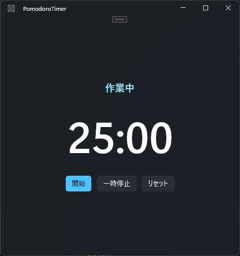
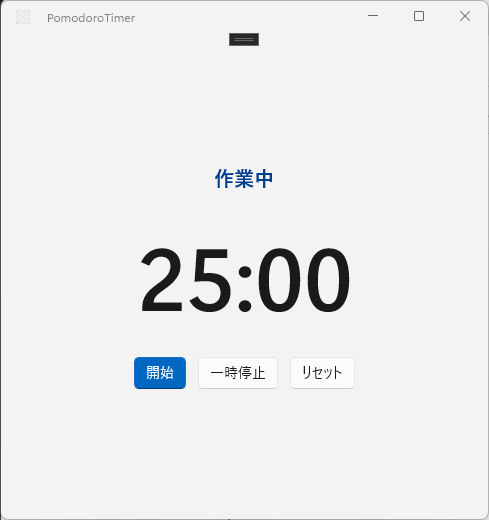

<!-- # WinUI Agent Plugin を使って、WinUI 3 アプリを自然言語で作ってみた -->

## この記事は何？

**「Claude Code に入れると、WinUI 3 アプリを自然言語の指示だけで作れるようになるプラグイン」** を紹介します。

Windows のデスクトップアプリ開発は、環境構築が独特だったり、UI の書き方に癖があったりで「なんだか敷居が高そう」と感じられがちです。でも、AI エージェントがその面倒な部分を肩代わりしてくれるなら話は別。この記事では、**このプラグインで具体的に何ができるのか**を、実際に小さなアプリを1本作りながら紹介していきます。普段デスクトップ開発をしない人でも「意外とすぐ作れるじゃん」と感じてもらえるはずです。

> **WinUI 3 とは？** Windows のモダンなデスクトップアプリを作るための最新UIフレームワークです。画面はコードで直接組み立てるのではなく、**XAML**（HTML/CSS のように、UIの構造と見た目を宣言的に書くマークアップ）で記述します。

<!-- <iframe width="600" height="400" src="https://www.youtube.com/embed/7OK30hI5h-I" title="WinUIエージェントプラグインのご紹介：AIエージェントでWinUIアプリを構築しましょう" frameborder="0" allow="accelerometer; autoplay; clipboard-write; encrypted-media; gyroscope; picture-in-picture; web-share" referrerpolicy="strict-origin-when-cross-origin" allowfullscreen></iframe> -->

この記事では、**「1つの指示から動くポモドーロタイマーができるまで」** を通しで見ていきます。サクッと5分で読めます。

---

## 導入手順

まず `winapp` CLI（Windows App Development CLI）が必要です。

```powershell
winget install Microsoft.winappcli --source winget
```

その上で、Claude Code にプラグインを追加します。

```powershell
claude plugin marketplace add microsoft/win-dev-skills
claude plugin install winui@win-dev-skills
```

> 💡 このプラグインは Claude Code 専用ではありません。**GitHub Copilot CLI**（ID は `winui@awesome-copilot`）や **OpenAI Codex** といった他の CLI 系エージェントからも同じスキルが使えます。普段使用しているエージェントに合わせて選べるので、本記事は Claude Code を前提に進めますが、読み替えて試せます。

> 💡 addでSSHのエラーが出る場合には、GitHubリポジトリのURL "https://github.com/microsoft/win-dev-skills.git" を明示的に指定すると回避できます。

---

## このプラグインでできること（全体像）

このプラグインの中身は、**8つのスキル**と、それらを束ねる **`winui-dev` エージェント**で構成されています。

`winui-dev` エージェントが司令塔で、「スキャフォールド → ビルド → 実行 → テスト → パッケージ化 → 移行」という開発の一連の流れを取り仕切ります。要求に応じて、下の8スキルから必要なものを自動で読み込んでくれる仕組みです（デフォルトでは `winui-design` と `winui-dev-workflow` を読み込みます）。

| スキル | ひとことで言うと |
|---|---|
| winui-setup | 前提環境（.NET SDK・WinApp CLI・テンプレート・開発者モード）のインストールと検証。`/winui-setup` で明示的に実行 |
| winui-dev-workflow | スキャフォールド → ビルド → 実行 → 反復のループをガイド |
| winui-design | Fluent Design 準拠の XAML レイアウト生成（コントロール検索ツール付き） |
| winui-code-review | WinUI 3 の正確性・アンチパターンのコードレビュー |
| winui-ui-testing | Windows UI Automation を使った UIテスト生成 |
| winui-packaging | MSIX パッケージ化・署名・ストア申請 |
| winui-wpf-migration | APIレベルのマッピングで WPF コードを WinUI 3 に移行 |
| winui-session-report | セッションでやったことの要約と次の手順の提案 |

**今回は `winui-dev` エージェントに丸ごと任せます（内部で `winui-design` と `winui-dev-workflow` が働きます）。**

---

## ハンズオン：ポモドーロタイマーを作る

### 1. 指示を出す

Claude Code に、こう頼むだけです。

```
WinUI 3 でシンプルなポモドーロタイマーを作って。
- 25分カウントダウン → 5分休憩、を切り替えられる
- 開始 / 一時停止 / リセット ボタン
- 残り時間を大きく表示
- Light / Dark テーマに対応
```

### 2. エージェントが作業する

すると、エージェントが自動で以下をこなします。

- MVVM テンプレートでプロジェクトを生成
  （内部的には `dotnet new winui-mvvm -n PomodoroTimer` が走る）
- XAML でUIをレイアウト
- C# でタイマーのロジックを実装（`DispatcherTimer` + MVVM）
- ビルドして、エラーがあれば自己修正

生成された XAML はこんな雰囲気です（抜粋）。

```xml
<StackPanel HorizontalAlignment="Center" VerticalAlignment="Center" Spacing="24">
    <TextBlock
        Text="{x:Bind ViewModel.PhaseText, Mode=OneWay}"
        HorizontalAlignment="Center"
        Style="{StaticResource SubtitleTextBlockStyle}"
        Foreground="{ThemeResource AccentTextFillColorPrimaryBrush}" />
    <TextBlock
        Text="{x:Bind ViewModel.TimeText, Mode=OneWay}"
        HorizontalAlignment="Center"
        FontSize="88" FontWeight="SemiBold" />
    <StackPanel Orientation="Horizontal" HorizontalAlignment="Center" Spacing="12">
        <Button Content="開始" Style="{StaticResource AccentButtonStyle}"
                Command="{x:Bind ViewModel.StartCommand}" />
        <Button Content="一時停止" Command="{x:Bind ViewModel.PauseCommand}" />
        <Button Content="リセット" Command="{x:Bind ViewModel.ResetCommand}" />
    </StackPanel>
</StackPanel>
```

`{x:Bind ...}` は、画面（XAML）と裏側のデータを結びつける**データバインディング**です。テンプレート内に `{{ 変数 }}` のような記法で値を差し込む、あの仕組みのデスクトップ版だと思ってください。値の表示だけでなく、双方向の同期やボタン操作の接続もこれで書けます。
ロジックは `ViewModel` に分離する **MVVM**で書かれ、ViewModel 側も `[ObservableProperty]` / `[RelayCommand]`（CommunityToolkit.Mvvm）を使った今どきの書き方で生成されます。

こうした WinUI の作法や `ThemeResource` によるテーマ対応が、こちらで細かく指定しなくても最初から入っている——これがプラグインの効きどころです。

### 3. 起動して確認

ビルドと実行は付属の `BuildAndRun.ps1`（`winui-dev-workflow` スキル同梱）に任せます。
プラットフォーム判定・ビルド・`winapp run` での起動までを自動でやってくれます。

```powershell
.\BuildAndRun.ps1
```

数十秒で `BUILD SUCCEEDED` → アプリが起動します。実際の画面がこちら（Dark テーマ）。

<!-- ▼起動画面のスクショ。撮影済みの実物を貼る。Light テーマ版も並べると良い -->
<!--  -->
<!--  -->


「作業中」フェーズの `25:00` が表示され、**開始**を押すとちゃんとカウントダウンが始まります
（`25:00 → 24:46 …`）。指示から数分で、Fluent Design 準拠の動くアプリが手元に出来上がりました。

### 4. テーマ対応を確かめる

WinUI 3 の嬉しいところは、**Light / Dark / High Contrast を OS の設定に追従して自動で切り替えてくれる**ことです。今回のアプリも、こちらでテーマ対応のコードを書いた覚えはありませんが、ちゃんと両対応になっています。

Windows の設定 → 個人用設定 → 色 で「モード」を **ライト** に変えると、アプリも即座に明るい配色に変わります。

<!-- ▼Lightテーマでの起動画面スクショ -->
<!--  -->
<!--  -->


配色・コントラスト・アクセントカラーが自動で調整される点に注目してください。ここを自前で作り込もうとすると地味に手間ですが、`ThemeResource` を使った適切なXAMLをエージェントが最初から書いてくれるので、意識せずに対応できています。

---

## 使ってみた所感

正直なところの良し悪しです。

**良かった点**
- 環境構築とビルドの「最初のつまずきポイント」をエージェントが吸収してくれる
- XAML の作法（`x:Bind`、MVVM、テーマ対応）を最初から正しく書いてくれるので、あとから直す手間が少ない
- ビルドエラーを自分で読んで直してくれるループが快適

**人間が判断すべき点**
- 見た目の細部（余白・配色の好み）は結局こちらのレビューが要る
- 複雑な業務ロジックは、丸投げより「設計は自分、実装を任せる」の役割分担が現実的

---

## まとめ

- WinUI Agent Plugin は、**WinUI 3 アプリを自然言語で作れる**ようにするプラグイン（Claude Code / GitHub Copilot CLI / OpenAI Codex で使える）
- 開発だけでなく、**設計・テスト・WPFからの移行・MSIX配布**まで一通りのスキルが揃っている
- 今回は触れなかったが、こんなこともできる：
  - 既存 **WPF アプリを WinUI 3 へ移行**（`winui-wpf-migration`）
  - **UI の自動テスト**（`winui-ui-testing`）
  - **MSIX パッケージ化して配布**（`winui-packaging`）
    ※ MSIX は Windows 標準のアプリ配布形式。Web でいう「ビルド成果物をデプロイ可能な形に固める」工程にあたります

## 参考リンク

- [WinUI エージェント プラグインの紹介動画（YouTube）](https://www.youtube.com/watch?v=7OK30hI5h-I) — プラグインの概要と動作イメージを短時間で掴める公式デモ
- [WinUI エージェント プラグイン 公式ドキュメント（Claude Code 版）](https://learn.microsoft.com/ja-jp/windows/apps/develop/ai-assisted/winui-agent-plugin?tabs=claude-code) — 8スキルと winui-dev エージェントの正式な解説・導入手順
- [microsoft/win-dev-skills（GitHub）](https://github.com/microsoft/win-dev-skills) — プラグイン本体のリポジトリ。スキルの中身やルールを読める
- [ysk-hello/PomodoroTimer（GitHub）](https://github.com/ysk-hello/PomodoroTimer) — 本記事で作ったポモドーロタイマーのサンプルコード
